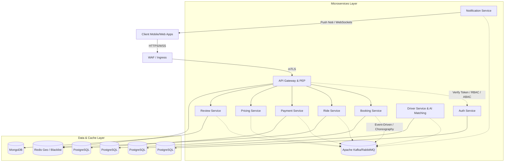

# 🚖 CAB BOOKING SYSTEM - Modern System Architecture Design

## 📋 Tóm tắt dự án (Abstract)
Dự án này trình bày bản thiết kế kiến trúc hoàn chỉnh cho hệ thống ứng dụng đặt xe Taxi (CAB Booking System) theo chuẩn **Kiến trúc Microservices**. Hệ thống được thiết kế hướng **cloud-native**, đáp ứng các yêu cầu khắt khe về xử lý thời gian thực (real-time), khả năng mở rộng (scalability), độ tin cậy, và bảo mật theo mô hình **Zero Trust**. Ngoài ra, hệ thống còn tích hợp **Trí tuệ nhân tạo (AI)** để tối ưu hóa vận hành ghép chuyến.

Mục tiêu thiết kế đảm bảo không có điểm lỗi duy nhất (Single Point of Failure), áp dụng nguyên lý Async-first (Event-driven) và Database per service.

---

## ✨ Các tính năng & Kiến trúc nổi bật
* **Ghép tài xế thông minh (AI Driver Matching):** Sử dụng AI để chọn tài xế tối ưu dựa trên khoảng cách GPS, lịch sử chuyến đi và hành vi.
* **Định giá động & ETA (Surge Pricing & ETA Prediction):** Phần mềm tính toán giá cước dựa trên cung - cầu, thời gian, khu vực và dự đoán thời gian đến (ETA) chính xác.
* **Xử lý thời gian thực (Real-time GPS):** Cập nhật trạng thái và vị trí tài xế tức thời qua hệ thống WebSocket và Redis Geo.
* **Thanh toán phân tán (Payment Saga Pattern):** Xử lý thanh toán sử dụng phương thức Saga choreography-based (event-driven), đảm bảo không trừ tiền đúp hoặc mất tiền (eventual consistency).
* **Kiến trúc Bảo mật Zero Trust:** Mọi request đều bị giám sát. Tích hợp WAF, xác thực JWT/OAuth2 (RS256), phân quyền RBAC/ABAC động và bảo mật giao tiếp nội bộ qua mTLS.

---

## 🏗 Tổng quan Kiến trúc (Architecture Overview)

Hệ thống bao gồm các cụm Microservices chính được cách ly dữ liệu hoàn toàn:



1. **API Gateway:** PEP (Policy Enforcement Point) - Định vị luồng, xác thực JWT (RS256), hỗ trợ Token Revocation với Redis và Rate Limiting.
2. **Auth Service:** IAM Server cấp phát và quản lý rủi ro trên vòng đời JWT.
3. **Booking Service:** Trái tim quản lý quy trình đặt xe (Matching, Canceling).
4. **Ride Service:** Xử lý toạ độ GPS, luồng WebSockets giao tiếp thực với tài xế và user.
5. **Driver Service & AI:** Quản lý profile tài xế và tính toán khoảng cách thông minh, hệ số ưu tiên điều xe.
6. **Pricing Service:** Surge Pricing Engine (cập nhật bảng giá realtime).
7. **Payment Service:** External Gateway Integration & Wallet Management.
8. **Notification Service:** Kênh truyền tải FCM/APNs.
9. **Review Service:** Thu thập rating & feedback của các chuyến đi.

---

## 🛠 Stack Công nghệ (Technology Stack)

### Frontend (Client Layer)
* **Framework:** ReactJS / NextJS + TypeScript.
* **Styling & UI:** Tailwind CSS / MUI.
* **State & Real-time:** Redux Toolkit / React Query, Socket.IO Client, Mapbox/Google Maps SDK.

### Backend (Microservices Layer)
* **Runtime:** Node.js (ExpressJS).
* **API Communication:** RESTful API, gRPC (đồng bộ).
* **Event-driven (Async):** Apache Kafka, RabbitMQ.
* **Bảo mật:** Biometric, JWT, OAuth2, Zod/Joi validation, Redis Blacklist.

### Data Layer
* **Transactional:** PostgreSQL (ACID compliant).
* **Document/NoSQL:** MongoDB (tốc độ đọc ghi schema-less linh hoạt).
* **Cache & Geo-spatial:** Redis / Redis Geo.

### DevOps & Infrastructure
* **Container Orchestration:** Docker Compose, Kubernetes (EKS/GKE).
* **CI/CD & IaC:** Github Actions, Terraform.
* **Service Mesh:** Istio (phục vụ mTLS).
* **Monitoring & Logging:** Grafana, Prometheus, ELK Stack.

---

## 🚀 Trạng thái Phát triển (Current Scope)

Hiện tại repository đang có sẵn mã nguồn đã được cấu hình chặt chẽ để môi trường local có thể liên kết microservices. Mười (10) service cơ sở đã được chia module.

### Danh sách các Service vận hành độc lập (Service Matrix)

| Service | Thư mục | Port | Database |
|---|---|---:|---|
| **API Gateway** | `services/api-gateway` | `3000` | Redis (Cache) |
| **Auth** | `services/auth-service` | `3001` | PostgreSQL |
| **User** | `services/user-service` | `3002` | PostgreSQL |
| **Driver** | `services/driver-service` | `3003` | PostgreSQL |
| **Booking** | `services/booking-service` | `3004` | PostgreSQL |
| **Ride** | `services/ride-service` | `3005` | PostgreSQL / Redis |
| **Pricing** | `services/pricing-service` | `3006` | PostgreSQL |
| **Payment** | `services/payment-service` | `3007` | PostgreSQL |
| **Review** | `services/review-service` | `3008` | MongoDB |
| **Notification** | `services/notification-service`| `3009` | MongoDB |

---

## ⚙️ Hướng dẫn Khởi chạy (Local Development Quick Start)

### 1) Trình quyết môi trường (Prerequisites)
- [Node.js](https://nodejs.org/en/) >= 18
- [Docker](https://www.docker.com/) & Docker Compose
- PostgreSQL >= 14 (Có thể dùng Desktop hoặc Container)
- MongoDB >= 6

### 2) Cấu hình Biến môi trường (.env)
Chạy kịch bản sau để copy toàn bộ `.env.example` thành `.env` cho mọi cấu phần:

```bash
for d in services/*; do
  cp "$d/.env.example" "$d/.env"
done
```

> **Lưu ý:** Nếu test trên HĐH Windows PowerShell, bạn có thể copy thủ công hoặc chạy `Copy-Item services\*\.env.example -Destination { $_.DirectoryName + '\.env' }`.

### 3) Khởi động Cơ Sở Dữ Liệu
Sử dụng docker-compose.mongo.yml cho MongoDB và file khác (nếu có) cho các CSDL còn lại:
```bash
docker compose -f docker-compose.mongo.yml up -d
```

### 4) Chạy một Service bất kỳ
Mỗi Service có thể được khởi động bằng Nodemon một cách độc lập:
```bash
cd services/driver-service
npm install
npm run dev
```

Kiểm tra Health Check (ví dụ: `http://localhost:3003/health`).

---

## 🛡️ Tích hợp Security Zero Trust
Kiến trúc Microservices hiện đã được bổ trợ Module xác thực Zero Trust thông qua Middleware của thư mục `api-gateway`. Tích hợp:
- Bổ sung `JWT_PUBLIC_KEY` (Sử dụng Asymmetric Keys RS256).
- Rà soát Revoked Token trên **Redis Cache** mỗi khi request luân chuyển qua Gateway.
- ABAC Middleware chặn ngữ cảnh động (Driver đang Inactive không được phép spam GPS HTTP Call).

Mọi thông tin cần hỗ trợ hoặc phát triển CI/CD, vui lòng liên hệ Admin của Repository!
