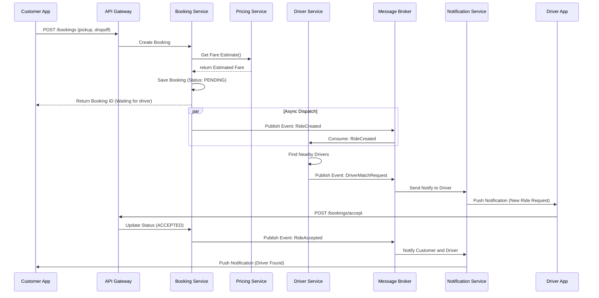
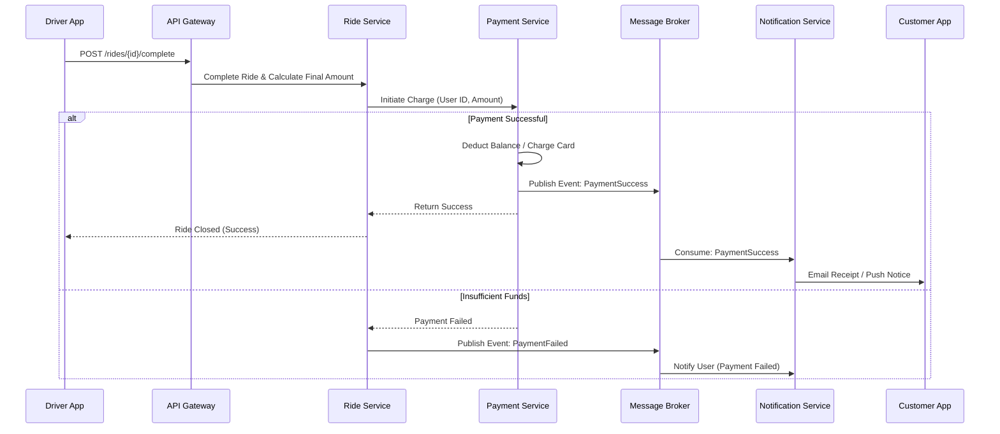
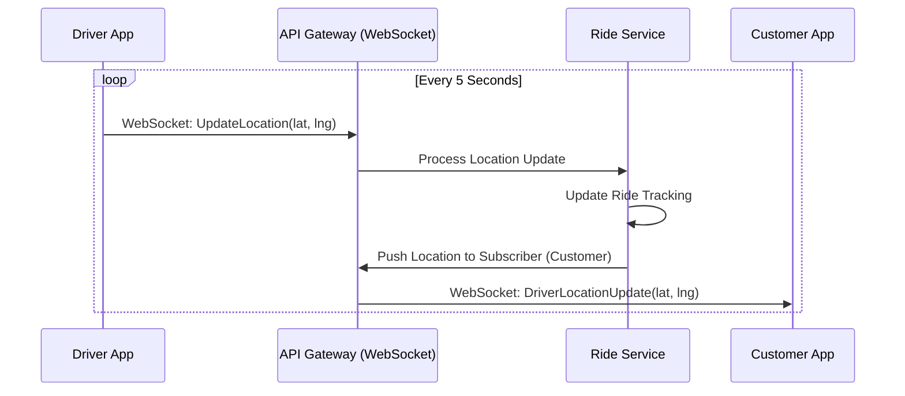

# Sequence Diagrams

## 1. Ride Booking Flow
**Scenario**: A customer requests a ride, and the system matches them with a driver.

## 2. Payment Flow
**Scenario**: Ride is completed, and payment is processed.

## 3. Real-time Location Update
**Scenario**: Driver updates location while moving.

